# ミッションステートメント
## 説明
### リポジトリについて
このリポジトリは自分のミッションステートメントをコード管理しておくためのものです。
### ミッションステートメントについて
ミッションステートメントとは7つの習慣の第2章で紹介されている手法。
## 本体

## draw.ioのリンク
[編集リンク](https://app.diagrams.net/#HAsunaro276%2Fmission-statement%2Fmain%2Fstatement.drawio#%7B%22pageId%22%3A%22YmL12bMKpDGza6XwsDPr%22%7D)
